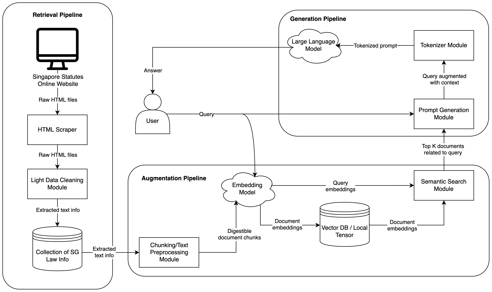

# Singapore Law RAG Pipeline

## Architecture



## Setup

First-time setup:

```sh
make
```

Activate the virtual environment:

```sh
conda activate sso-rag-pipeline
```

Update the environment (e.g. if `environment.yml` has been updated):

```sh
make update
```
